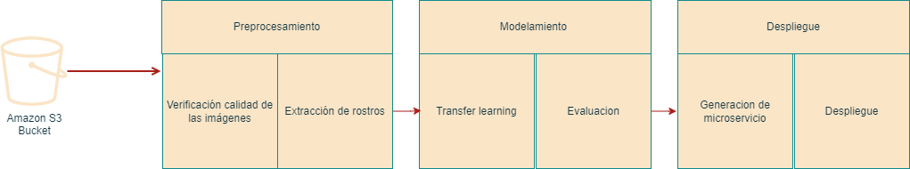

# Project Charter - Entendimiento del Negocio

## Nombre del Proyecto

sistema de reconocimiento de rostros en documentos que pueda clasificar si una imagen de rostro está superpuesta o no.

## Objetivo del Proyecto

El objetivo del proyecto es desarrollar un sistema de reconocimiento de rostros en documentos que pueda clasificar si una imagen de rostro está superpuesta o no. Esta clasificación es importante porque ayuda a garantizar la autenticidad y la integridad de los documentos que contienen imágenes de rostros.

La presencia de rostros superpuestos en documentos puede indicar posibles intentos de fraude o manipulación. Al detectar y clasificar correctamente estas imágenes, se pueden prevenir situaciones en las que se utilicen documentos falsificados o alterados con el propósito de engañar o defraudar a personas o instituciones.

La identificación precisa de rostros superpuestos puede ser especialmente relevante en campos como la verificación de identidad en servicios en línea, la seguridad en aeropuertos y fronteras, la detección de documentos falsificados, la autenticación biométrica y la lucha contra el fraude en documentos legales.

Al implementar un sistema de clasificación de rostros superpuestos en documentos, se puede mejorar la seguridad y confiabilidad de los procesos que dependen de la autenticidad de las imágenes faciales. Esto brinda una capa adicional de protección contra manipulaciones y engaños, y ayuda a mantener la integridad de los sistemas y servicios que utilizan imágenes de rostros como prueba o verificación.

En resumen, el objetivo de este proyecto es desarrollar una solución eficiente y precisa para identificar rostros superpuestos en documentos, lo cual es crucial para garantizar la seguridad, confiabilidad y autenticidad en una amplia gama de aplicaciones que dependen del reconocimiento facial.

## Alcance del Proyecto

### Incluye:

- [Descripción de los datos disponibles]

Para el desarrollo del proyecto, se cuenta con un conjunto de datos privado almacenado en Amazon S3 o Amazon Simple Storage Service. Este conjunto de datos consta de 250 documentos reales y 250 imágenes superpuestas, cada una de las cuales ha sido etiquetada y clasificada.

Debido a la sensibilidad de los datos y para garantizar la privacidad y confidencialidad, no se compartirá el conjunto de datos con terceros. El acceso y manejo de los datos se llevará a cabo siguiendo las políticas de seguridad y privacidad establecidas por la organización responsable del proyecto.

- [Descripción de los resultados esperados]
Se espera el despliegue de dos servicios:

Servicio de extracción de coordenadas del rostro para recorte: Al proporcionar un servicio dedicado para extraer las coordenadas del rostro en una imagen, se simplifica y agiliza el proceso de recorte de la imagen. Esto es especialmente útil cuando se trabaja con conjuntos de datos grandes o cuando se requiere un procesamiento eficiente en tiempo real. 

Servicio de estimación de imagen real o superpuesta: Un servicio separado que se especializa en la estimación de si una imagen es real o superpuesta es valioso en varios escenarios. Por ejemplo, en aplicaciones de verificación de identidad en línea, donde se necesitan decisiones rápidas y confiables sobre la autenticidad de una imagen facial. Este servicio permitirá a los usuarios cargar una imagen y recibir una clasificación precisa y rápida que indique si la imagen es real o superpuesta.

- [Criterios de éxito del proyecto]

Para que el proyecto sea culminado con éxito se requiere:

- Implementación de la extracción de coordenadas del rostro.
- Entrenamiento y validación de un modelo de clasificación.
- Despliegue de los servicios y prueba de extremo a extremo.

### Excluye:

- [Descripción de lo que no está incluido en el proyecto]
El enfoque del proyecto se basa en la aplicación de metodologías ágiles en Machine Learning, lo cual implica priorizar la entrega rápida de resultados funcionales y adaptarse a los cambios a lo largo del proceso de desarrollo. Dado este enfoque, no se realizará una optimización exhaustiva del modelo ni de sus hiperparámetros.

En lugar de buscar la optimización completa del modelo, el objetivo es desarrollar un modelo funcional que cumpla con los requisitos establecidos y brinde resultados aceptables en términos de precisión y rendimiento. Se enfocará en iteraciones rápidas y en la mejora continua del modelo a medida que se recopilen y analicen los resultados.

## Metodología

[Descripción breve de la metodología que se utilizará para llevar a cabo el proyecto]

Adquisición y preparación de datos:

Recopila los datos.

Limpia y preprocesa los datos para asegurar su calidad y coherencia.
Realiza análisis exploratorios para obtener información inicial sobre los datos.

Desarrollo del modelo o solución:

Selecciona el enfoque o algoritmo adecuado para tu problema.
Diseña y desarrolla el modelo, utilizando las herramientas y tecnologías adecuadas.

Evaluación y validación:

Evalúa el rendimiento de tu modelo o solución utilizando métricas y técnicas apropiadas.
Valida los resultados obtenidos y verifica si cumplen con los objetivos del proyecto.
Realiza pruebas y validaciones adicionales según sea necesario.

Implementación y despliegue:

Prepara tu solución para la implementación en un entorno de producción.

Realiza el despliegue de tu solución en el entorno objetivo.

Acontinuacion se muestra el diagrama de la metodologia planteada 

## Cronograma

| Etapa | Duración Estimada | Fechas |
|------|---------|-------|
| Entendimiento del negocio y carga de datos | 1 semanas | del 30 de mayo al 6 de junio |
| Preprocesamiento, análisis exploratorio | 1 semanas | del 7 de junio al 13 de junio |
| Modelamiento y extracción de características | 14 semanas | del 16 de junio al 21 de junio |
| Evaluación | 0.5 semanas | del 22 de junio al 30 de junio |
| Despliegue | 0.5 semanas | del 31 de julio al 4 de julio |

## Equipo del Proyecto

- [Hector Ignacio Sanabria Pedraza - Machine Learning Engineer ]

## Presupuesto

[Descripción del presupuesto asignado al proyecto]

## Stakeholders

- [Nombre y cargo de los stakeholders del proyecto]
- [Descripción de la relación con los stakeholders]
- [Expectativas de los stakeholders]

## Aprobaciones

- [Nombre y cargo del aprobador del proyecto]
- [Firma del aprobador]
- [Fecha de aprobación]

