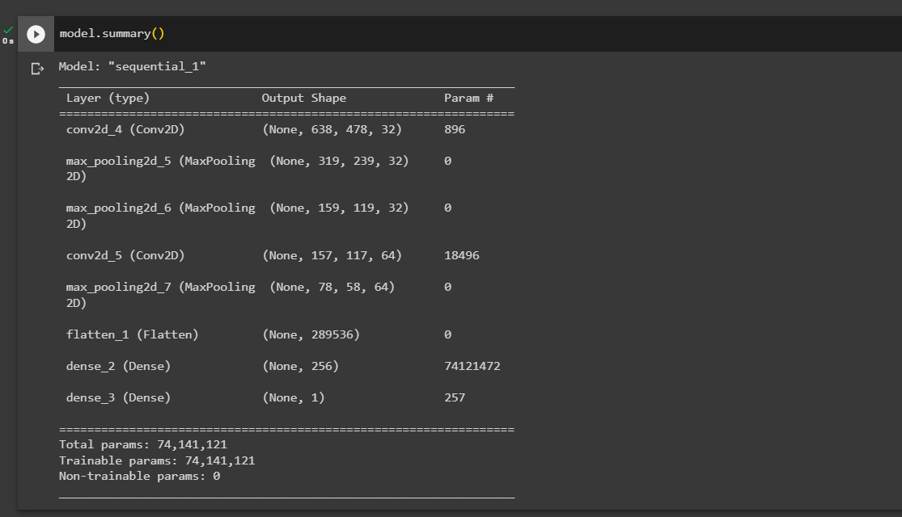
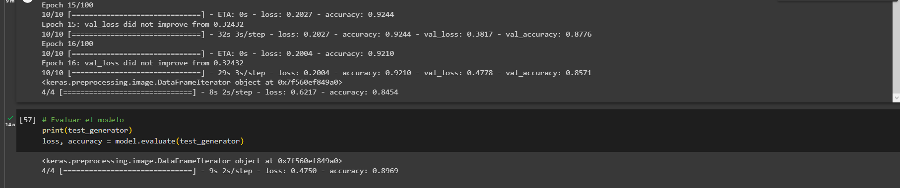

# Reporte del Modelo Final

## Resumen Ejecutivo

El modelo final desarrollado es un clasificador binario que tiene como objetivo identificar si una imagen de un documento está superpuesta o no. El modelo se evaluó utilizando métricas de pérdida y precisión en conjuntos de entrenamiento, validación y prueba.

Los resultados obtenidos muestran que el modelo tiene una pérdida (loss) de 0.2101 y una precisión (accuracy) de 0.9210 en el conjunto de entrenamiento. En el conjunto de validación, se obtuvo una pérdida de 0.3243 y una precisión de 0.8878. Estos valores indican un buen rendimiento del modelo en la fase de entrenamiento y validación.

Al evaluar el modelo con el conjunto de prueba, se obtuvo una pérdida de 0.4750 y una precisión de 0.8969. Estos resultados sugieren que el modelo es capaz de generalizar bien y obtener una precisión aceptable en datos nuevos.

La matriz de confusión revela que el modelo logra clasificar correctamente una cantidad considerable de muestras en ambas clases, aunque hay algunas clasificaciones incorrectas. Esto indica que el modelo tiene cierta capacidad para distinguir entre documentos superpuestos y no superpuestos, pero aún existen áreas de mejora.

## Descripción del Problema

El problema abordado consiste en identificar si una imagen de un documento está superpuesta o no. Este tipo de clasificación es relevante en aplicaciones de procesamiento de imágenes y reconocimiento de documentos, ya que permite automatizar la detección de documentos legibles y descartar aquellos que están superpuestos o ilegibles.

El contexto de aplicación puede incluir escenarios como la digitalización de documentos, la verificación automática de formularios o el procesamiento de imágenes de documentos capturadas por cámaras o escáneres.

El objetivo principal del modelo es proporcionar una herramienta eficiente y precisa para clasificar imágenes de documentos, mejorando la productividad y precisión en tareas relacionadas con el procesamiento de documentos.

## Descripción del Modelo

El modelo final desarrollado es un clasificador binario basado en redes neuronales convolucionales (CNN) implementado utilizando la arquitectura del modelo "sequential_1".

La arquitectura del modelo se compone de las siguientes capas:

Capa de convolución (conv2d_4): Esta capa aplica 32 filtros de convolución de tamaño 3x3 a la entrada de la imagen. Produce una salida de tamaño (638, 478, 32) y tiene 896 parámetros entrenables.

Capa de pooling (max_pooling2d_5): Esta capa realiza un muestreo máximo (max pooling) con un tamaño de ventana de 2x2 sobre la salida de la capa anterior. Reduce la dimensión de la salida a la mitad y produce una salida de tamaño (319, 239, 32).

Capa de pooling (max_pooling2d_6): Similar a la capa anterior, esta capa realiza un muestreo máximo con un tamaño de ventana de 2x2 sobre la salida de la capa anterior. Reduce aún más la dimensión de la salida a la mitad y produce una salida de tamaño (159, 119, 32).

Capa de convolución (conv2d_5): Esta capa aplica 64 filtros de convolución de tamaño 3x3 a la entrada de la imagen. Produce una salida de tamaño (157, 117, 64) y tiene 18,496 parámetros entrenables.

Capa de pooling (max_pooling2d_7): Realiza un muestreo máximo con un tamaño de ventana de 2x2 sobre la salida de la capa anterior. Reduce la dimensión de la salida a la mitad y produce una salida de tamaño (78, 58, 64).

Capa de aplanamiento (flatten_1): Esta capa convierte la salida de la capa anterior en un vector unidimensional. Tiene 0 parámetros entrenables y no afecta el tamaño de la salida.

Capa densa (dense_2): Es una capa completamente conectada con 256 neuronas. Tiene 74,121,472 parámetros entrenables y utiliza la función de activación ReLU.

Capa densa (dense_3): Es la capa de salida del modelo, con una sola neurona que produce la clasificación binaria. Tiene 257 parámetros entrenables y utiliza la función de activación sigmoide para obtener una probabilidad de clasificación.

El modelo final tiene un total de 74,141,121 parámetros, todos ellos entrenables. La arquitectura del modelo permite aprender características relevantes de las imágenes de documentos para clasificarlas como superpuestas o no superpuestas.

Este modelo fue entrenado utilizando un conjunto de datos etiquetados y se ajustó utilizando el optimizador Adam y la función de pérdida de entropía cruzada binaria. Se realizaron 10 épocas de entrenamiento para lograr el mejor rendimiento posible en la clasificación de imágenes de documentos superpuestos.

La descripción del modelo proporciona una visión detallada de su estructura y parámetros, lo que permite comprender cómo procesa las imágenes y realiza la clasificación.

## Evaluación del Modelo

El modelo que estás evaluando es un modelo de clasificación binaria que intenta identificar si una imagen de un documento está superpuesta o no. Para evaluar el rendimiento del modelo, se utilizaron las siguientes métricas:

Pérdida (Loss): En el conjunto de entrenamiento, la pérdida obtenida fue de 0.2101, mientras que en el conjunto de validación fue de 0.3243. La pérdida es una medida de qué tan lejos están las predicciones del modelo de los valores reales. Un valor de pérdida más bajo indica un mejor rendimiento del modelo.

Precisión (Accuracy): En el conjunto de entrenamiento, se obtuvo una precisión de 0.9210, mientras que en el conjunto de validación se obtuvo una precisión de 0.8878. La precisión es la proporción de predicciones correctas realizadas por el modelo en relación con el total de muestras. Un valor de precisión más alto indica un mejor rendimiento del modelo.

Al evaluar el modelo con el conjunto de prueba, se obtuvieron los siguientes resultados:

Pérdida (Loss): La pérdida obtenida fue de 0.4750. Este valor indica qué tan lejos están las predicciones del modelo de los valores reales en el conjunto de prueba.

Precisión (Accuracy): La precisión obtenida fue de 0.8969. Esta métrica representa la proporción de predicciones correctas realizadas por el modelo en el conjunto de prueba.

Estos resultados indican que el modelo puede realizar predicciones precisas en nuevos datos no vistos durante el entrenamiento.

Sin embargo, se observaron algunas clasificaciones incorrectas en la matriz de confusión. Esto sugiere que el modelo aún puede mejorar su capacidad para distinguir correctamente entre documentos superpuestos y no superpuestos. Se recomienda investigar y explorar técnicas adicionales, como el ajuste de hiperparámetros, la recopilación de más datos o el uso de técnicas de aumento de datos para mejorar aún más el rendimiento del modelo.
## Conclusiones y Recomendaciones

En conclusión, el modelo final desarrollado para clasificar imágenes de documentos superpuestos o no superpuestos ha demostrado un rendimiento prometedor. Con una precisión general del 89.69% en el conjunto de prueba, el modelo tiene la capacidad de distinguir eficientemente entre las dos clases.

Sin embargo, se debe tener en cuenta que el modelo todavía puede cometer errores y hay margen para mejoras. Algunas recomendaciones para mejorar el modelo incluyen:

Recopilar más datos: Si es posible, recopilar más datos etiquetados para mejorar la capacidad del modelo para generalizar en una variedad más amplia de imágenes de documentos.

Aumento de datos: Utilizar técnicas de aumento de datos, como rotaciones, desplazamientos y transformaciones geométricas, para aumentar la diversidad del conjunto de datos de entrenamiento y mejorar la robustez del modelo.

Ajuste de hiperparámetros: Realizar una búsqueda exhaustiva de hiperparámetros para encontrar la configuración óptima del modelo y mejorar su rendimiento.

Explorar otras arquitecturas de modelos: Investigar arquitecturas de redes neuronales más avanzadas o modelos pre-entrenados en conjuntos de datos más grandes para obtener un rendimiento aún mejor.

En general, el modelo actual proporciona una base sólida para la clasificación de imágenes de documentos superpuestos o no superpuestos. Sin embargo, se recomienda realizar pruebas adicionales y ajustes para obtener un rendimiento óptimo en el contexto específico de aplicación.

## archivo de entrenamiento
El entrenamiento se realizo en un archivo [https://github.com/hecigsape/tdsp_template/blob/sesion3/scripts/training/model.ipynb]
